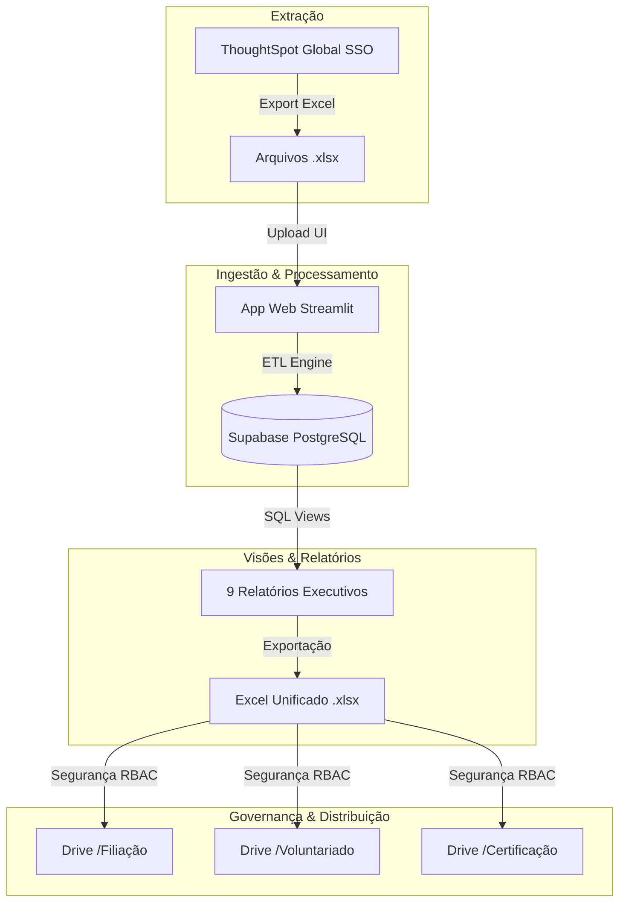
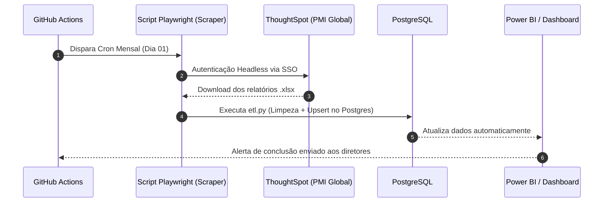

# Estratégia de Dados & Governança — PMI Rio (Visão Data PO)

## 1. Diagnóstico da Situação Atual & Justificativa Técnica

### 1.1 Contexto e Desafios
- **Restrições de Autenticação do Google**: As políticas de privacidade recentes do Google Workspace bloqueiam a execução de scripts no Google Colab que tentem escrever diretamente na API do Google Sheets (`gspread`). Isso invalidou o antigo notebook de atualização.
- **Acesso Exclusivo**: Atualmente, apenas você possui acesso com SSO aos dados do ThoughtSpot do PMI Global.
- **Migração para Supabase**: A infraestrutura do capítulo adota o **Supabase (PostgreSQL)** como banco de dados nuvem gerenciado, garantindo alta disponibilidade, conexões seguras e persistência relacional das 4 tabelas (`person`, `membership`, `certification`, `voluntary`).
- **Desafio de Governança**: O modelo antigo disponibilizava links públicos no Google Sites, o que trazia riscos de privacidade e conformidade com a LGPD (Lei Geral de Proteção de Dados), pois continha listas nominais com e-mails e telefones de filiados.

---

## 2. Nova Arquitetura de Dados

---

## 3. Matriz de Controle de Acesso e Governança (LGPD)

Para substituir a entrega pública no Google Sites, adotamos a matriz de **Controle de Acesso Baseado em Papéis (RBAC)**:

| Diretoria Destinatária | Visualizações / Relatórios | Dados Permitidos | Canal de Entrega Recomendado |
| :--- | :--- | :--- | :--- |
| **Filiação & Retenção** | • Novos Filiados (30D) • Desfiliados (30D) • A Vencer (30D / 90D) • Marcos (3M / 6M) • Aniversariantes de Filiação | Nome Completo, E-mail, Telefone, Data da 1ª Filiação, Data de Expiração, Classificação | Pasta Restrita do Google Drive (`/Governança_Dados/Filiação`) com acesso apenas a diretores/gerentes de Filiação |
| **Voluntariado** | • Candidaturas Elegíveis (Deduplicadas e com status ativo) | Nome do Candidato, E-mail, Oportunidade, Status, Datas | Pasta Restrita do Google Drive (`/Governança_Dados/Voluntariado`) com acesso apenas à equipe de Voluntariado |
| **Certificação** | • Profissionais Certificados nos Últimos 3 Meses | Nome Completo, E-mail, Nome da Certificação (PMP, CAPM, etc), Status, Datas | Pasta Restrita do Google Drive (`/Governança_Dados/Certificação`) com acesso apenas à equipe de Certificação |

---

## 4. Fluxo Operacional (Curto Prazo — Manual Seguro)

1. **Baixar Extrações**: Baixar os relatórios em Excel do ThoughtSpot (Membros, Certificações e Voluntários).
2. **Fazer Upload na App Web**: Abrir o aplicativo Streamlit (`streamlit run app.py`) e fazer upload das planilhas na aba **Ingestão & Atualização (ETL)**.
3. **Executar Ingestão**: Clicar em `Executar Pipeline ETL`. O sistema padronizará os nomes, deduplicará os dados e atualizará o PostgreSQL.
4. **Baixar Relatório Unificado**: Ir até a aba **Central de Relatórios** e clicar em `Baixar Relatório Unificado Completo (.xlsx)`.
5. **Distribuir com Segurança**: Salvar o arquivo no Google Drive do PMI Rio, compartilhando apenas as abas/pastas apropriadas com os responsáveis.

---

## 5. Roadmap de Automação de Médio/Longo Prazo (Fase 2)

### Passos para a Fase 2:
1. **RPA / Web Scraping Headless**: Desenvolver um script Python usando **Playwright** que realiza o login via SSO no ThoughtSpot e faz o download automático dos 3 arquivos `.xlsx`.
2. **Automação via GitHub Actions**: Configurar um workflow agendado (`cron: '0 8 1 * *'`) no GitHub Actions para rodar o scraping, atualizar o banco de dados PostgreSQL e disparar notificações.
3. **Painel BI Interativo**: Conectar o PostgreSQL diretamente ao **Power BI** ou **Metabase**, eliminando a necessidade de envio manual de planilhas.
